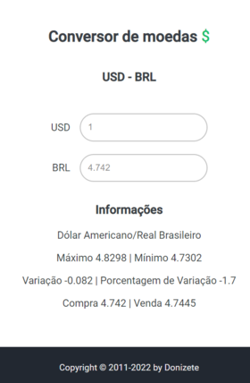

# Currency Quote

Make conversion of Dollar to Real.



Este projeto faz uso do framework flask e consome uma API de Cotações de Moedas do site AWESOMEAPI.

#### Como utilizar

```bash
# Clone este repositório
git clone <https://github.com/KOOLDE/Currency_quote.git>

# Crie uma virtualenv dentro do projeto e ative a virtualenv
virtualenv venv
```

#### Requerimentos

Para instalar os módulos que este projeto faz uso digite o comando a baixo no seu prompt de comando.

```bash
# Instalação
pip install -r requirements.txt
```

#### Subir um servidor local

Depois de fazer a ativação da virtualenv e instalar os módulos necessários, digite o comando a baixo.

```bash
# Run
flask run
```